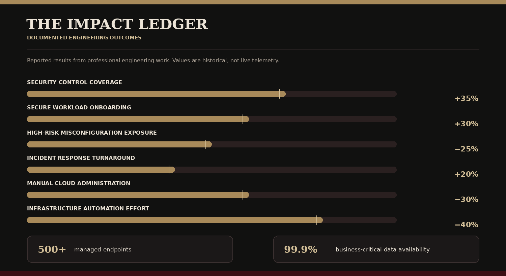

<!-- ============================================================
SAI VIGNESH RAYAL · GITHUB PROFILE
Premium editorial system: Deep Crimson + Antique Gold + Charcoal

Important:
- Historical impact is shown as a static visual ledger.
- Live GitHub activity uses dynamic cards.
- Modern security terms are separated from résumé-backed experience.
============================================================= -->

<p align="center">
  
</p>

<p align="center">
  <sub><strong>SECURITY ENGINEERING · CLOUD SECURITY · AUTOMATION · RISK & COMPLIANCE</strong></sub>
</p>

<p align="center">
  <a href="https://github.com/Saivignesh-1177">
    
  </a>
  
  
  
  
</p>

---

# THE LEAD

### **Security belongs in the architecture.**

Cybersecurity Engineer with **5+ years of experience** across **Azure, AWS, and Microsoft 365**, focused on cloud security, infrastructure protection, vulnerability and risk management, incident response, security automation, endpoint security, compliance, and operational resilience.

I work at the intersection of:

`CLOUD` · `IDENTITY` · `SECURITY ENGINEERING` · `AUTOMATION` · `GOVERNANCE`

> **Design securely. Automate deliberately. Detect continuously. Respond decisively.**

---

# THE SECURITY MAP

A deliberate progression from fundamentals to architecture.

| LAYER | FOCUS |
|---|---|
| **01 · Foundations** | Networking · Linux · Windows · Hardening · Logging · Access Control |
| **02 · Cloud Infrastructure** | Azure · AWS · Compute · Network · Storage · Database Security |
| **03 · Identity & Data** | IAM · RBAC · MFA · Least Privilege · DLP · Encryption |
| **04 · Cloud Posture & Workloads** | CSPM · CWPP · CNAPP · CIEM · DSPM · Containers |
| **05 · DevSecOps** | Secure SDLC · SAST · SCA · IaC Security · SBOM · Secrets |
| **06 · Detection & Response** | SIEM · XDR · Threat Intelligence · Incident Response · Hunting |
| **07 · GRC** | Risk · Control Mapping · Audit Readiness · NIST · CIS · ISO |
| **08 · Architecture** | Zero Trust · Cloud-Native Security · Resilience · AI Security |

---

# THE ENGINEERING STACK

<details>
<summary><strong>01 · SECURITY FOUNDATIONS</strong></summary>

`Networking` · `TCP/IP` · `DNS` · `HTTP/HTTPS` · `TLS`  
`Linux` · `Windows` · `Firewalls` · `Segmentation`  
`Hardening` · `Configuration Baselines` · `Patch Management`  
`Logging` · `Monitoring` · `Access Control` · `Least Privilege`

**Security practice**

`Vulnerability Management` · `Security Assessments` · `Risk Analysis`  
`Threat Management` · `Data Protection` · `Endpoint Security`

</details>

<details>
<summary><strong>02 · CLOUD INFRASTRUCTURE SECURITY</strong></summary>

**Azure**

`Azure VMs` · `Azure Networking` · `Azure Storage` · `Azure SQL`

**AWS**

`EC2` · `EKS` · `VPC` · `S3` · `RDS`

**Controls**

`Network Security Groups` · `Security Groups` · `Private Connectivity`  
`Load Balancing` · `Auto Scaling` · `Secure Configuration`

</details>

<details>
<summary><strong>03 · IDENTITY · ACCESS · DATA</strong></summary>

**Identity & access**

`IAM` · `RBAC` · `MFA` · `Conditional Access` · `PAM`  
`Workload Identity` · `Managed Identities` · `Service Principals`  
`Access Reviews` · `Least Privilege`

**Data security**

`DLP` · `Data Classification` · `Encryption at Rest`  
`Encryption in Transit` · `Key Management` · `Secrets Management`

**Microsoft security / endpoint**

`Microsoft Intune` · `SCCM` · `Microsoft Defender`  
`Microsoft 365 Security` · `Exchange Online` · `SharePoint Online`  
`Teams` · `OneDrive`

</details>

<details>
<summary><strong>04 · CLOUD POSTURE · WORKLOAD SECURITY</strong></summary>

**Modern security domains**

`CSPM` · `CWPP` · `CNAPP` · `CIEM` · `DSPM`  
`Container Security` · `Kubernetes Security` · `Runtime Protection`  
`Misconfiguration Management` · `Policy Enforcement`  
`Security Benchmarks` · `Attack Path Analysis`

**Microsoft ecosystem**

`Microsoft Defender for Cloud` · `Microsoft Sentinel`  
`Microsoft Defender XDR` · `Microsoft Entra ID`  
`Azure Policy` · `Azure Key Vault` · `Azure Monitor` · `Log Analytics`

**AWS ecosystem**

`AWS IAM` · `AWS Security Hub` · `Amazon GuardDuty`  
`Amazon Inspector` · `Amazon Macie` · `Amazon Security Lake`  
`AWS CloudTrail` · `KMS`

</details>

<details>
<summary><strong>05 · DEVSECOPS · SOFTWARE SUPPLY CHAIN</strong></summary>

`Secure SDLC` · `Threat Modeling` · `SAST` · `DAST` · `SCA`  
`IaC Security` · `Policy as Code` · `SBOM` · `Dependency Security`  
`Secrets Detection` · `Container Security` · `CI/CD Security`

**GitHub security**

`CodeQL` · `Code Scanning` · `Secret Scanning` · `Push Protection`  
`Dependabot` · `Dependency Review` · `GitHub Actions Security` · `OIDC`

**Automation**

`Terraform` · `PowerShell` · `Ansible` · `JSON Templates`  
`Jenkins` · `Docker` · `Kubernetes`

</details>

<details>
<summary><strong>06 · DETECTION · RESPONSE · THREAT OPERATIONS</strong></summary>

**Detection**

`SIEM` · `XDR` · `SOAR` · `Security Telemetry`  
`Threat Intelligence` · `IOC / IOA Analysis` · `Detection Engineering`

**Response**

`Incident Response` · `Incident Triage` · `Containment`  
`Eradication` · `Recovery` · `Root Cause Analysis` · `Threat Hunting`

**Observability**

`Microsoft Sentinel` · `Datadog` · `Dynatrace`  
`Grafana` · `Nagios` · `Azure Monitor`

</details>

<details>
<summary><strong>07 · GOVERNANCE · RISK · COMPLIANCE</strong></summary>

**Risk & governance**

`GRC` · `Cybersecurity Risk Management` · `Risk Assessment`  
`Control Assessment` · `Control Mapping` · `Security Requirements`  
`Policy & Standards` · `Security Architecture Review`  
`Change Management` · `Audit Readiness`

**Resilience**

`Business Continuity` · `Disaster Recovery` · `Backup Strategy`  
`Operational Resilience` · `Recovery Planning`

**Frameworks & standards**

`NIST CSF 2.0` · `NIST SP 800-53` · `CIS Controls v8.1`  
`CIS Benchmarks` · `ISO/IEC 27001:2022` · `ISO/IEC 27002:2022`  
`CSA Cloud Controls Matrix (CCM) v4.1` · `PCI DSS v4.0.1`  
`SOC 2 Trust Services Criteria` · `HIPAA` · `GDPR` · `FedRAMP Rev. 5`

**Résumé-backed compliance**

`DLP` · `GDPR` · `ISO 27001` · `HIPAA-aligned practices`  
`NIST-based controls` · `Change Management` · `Security Awareness`

</details>

<details>
<summary><strong>08 · SECURITY ARCHITECTURE · EMERGING SECURITY</strong></summary>

**Zero Trust**

`Verify Explicitly` · `Least Privilege` · `Assume Breach`  
`Continuous Verification` · `Identity-Centric Security` · `Workload Trust`

**Cloud architecture**

`Secure-by-Design` · `Hybrid Cloud Security` · `Multicloud Security`  
`Cloud-Native Security` · `Security Guardrails` · `Resilient Architecture`

**Emerging focus**

`AI Security Posture Management` · `AI Workload Security`  
`AI Supply Chain Security` · `AI Data Protection` · `Agent Security`

</details>

---

# THE IMPACT LEDGER

<p align="center">
  
</p>

<sub>Historical outcomes reported in the professional résumé; these figures are not live GitHub telemetry.</sub>

---

# LIVE GITHUB SIGNAL

<p align="center">
  
  
</p>

<p align="center">
  <sub>Live cards reflect current GitHub repository activity. The GitHub profile itself remains the authoritative source for contributions.</sub>
</p>

---

# THE AUTOMATION DESK

```text
                         SECURITY REQUIREMENT
                                  │
                                  ▼
                         CLOUD ARCHITECTURE
                                  │
                   ┌──────────────┴──────────────┐
                   ▼                             ▼
                 AZURE                           AWS
                   │                             │
                   └──────────────┬──────────────┘
                                  ▼
                           TERRAFORM / IaC
                                  │
                                  ▼
                         POLICY + CONTROLS
                                  │
                                  ▼
                       MONITORING + DETECTION
                                  │
                                  ▼
                         INCIDENT RESPONSE
                                  │
                                  ▼
                        RESILIENCE + RECOVERY
```

---

# DOCUMENTED FOUNDATION

These are the areas explicitly represented in the source résumé and form the experience-backed core of this profile:

`Azure Security` · `AWS Security` · `Microsoft 365 Security`  
`Cloud Hardening` · `Secure Configuration Baselines`  
`Vulnerability Testing` · `Risk Analysis` · `Security Assessments`  
`Incident Response` · `Threat Management`  
`Intune` · `SCCM` · `Endpoint Compliance` · `Patching`  
`Terraform` · `PowerShell` · `Ansible` · `JSON Templates`  
`Backup` · `Disaster Recovery` · `Business Continuity`

---

# ENGINEERING PRINCIPLES

```yaml
security:
  architecture: "security by design"
  identity: "least privilege"
  infrastructure: "infrastructure as code"
  operations: "continuous monitoring"
  response: "automated where appropriate"
  governance: "measurable controls"
  resilience: "recoverable systems"
```

---

# EDUCATION

### Master of Artificial Intelligence

`Cloud Computing` · `Networking` · `Computer Algorithms`  
`Software Development with AI`

---

<p align="center">
  
  
  
  
</p>

<p align="center">
  <strong>BUILD SECURE · AUTOMATE DELIBERATELY · ENGINEER FOR RESILIENCE</strong>
</p>
